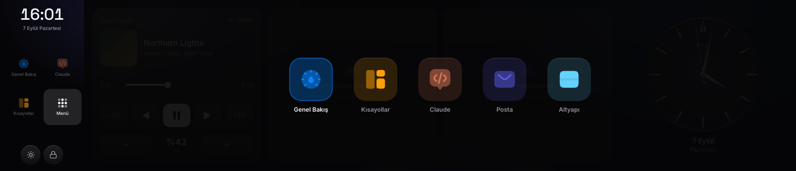

# RP5 Panel

A touch-panel dashboard for a Raspberry Pi 5 driving an ultra-wide 11.9″ strip display, fed live by a small agent running on your Mac. Now playing, project and server shortcuts, Claude Code sessions, your mail inbox, server monitoring, a Dynamic-Island-style attention layer, and a web admin panel backed by SQLite.

Built with Next.js 16, React 19, Tailwind v4 and Prisma. Only real data, only real actions: nothing on the panel is a mock.


| Lock screen | Menu | Shortcuts |
| --- | --- | --- |
|  |  |  |

## What it does

- **Overview.** A high-craft analog clock, a now-playing card with scrubbing, transport and volume, a live Claude Code activity card, an unread-mail glimpse and a server-health complication. Four fixed slots; empty slots stay quiet tiles.
- **Shortcuts.** One tap opens a project in VS Code or an SSH session in Termius or Terminal on the Mac. The toast shows the real result.
- **Claude.** Claude Code sessions on the Mac: running, waiting for you, or closed. Tokens per session, today's usage, and a live event feed for the selected session.
- **Mail.** Your Spark Desktop inbox, read directly from Spark's local database: accounts, unread counts, message list and preview.
- **Infra.** Server grid → containers → container dashboard, powered by [Beszel](https://beszel.dev). CPU, memory and network sparklines, container logs and `docker inspect`, with honest failure states.
- **Attention layer.** A Dynamic Island above every screen. `info` and `attention` notices collapse after a few seconds; `urgent` notices persist across restarts until you dismiss them. Anything can post a notice: the Mac agent, built-in monitors, a CI webhook, an uptime service.
- **Admin panel.** `/admin` from your computer: screens, shortcuts, notice rules, active notices, infra, mail, settings and security. Everything lives in SQLite; the kiosk pulls its configuration from the API, so nothing is hard-coded.
- **Lock screen.** Server-validated PIN, rate limited, auto-lock after inactivity.


## How it fits together

```
 Raspberry Pi 5, Chromium kiosk (1973×426 CSS px)       Your Mac
 ┌──────────────────────────────┐      HTTP + SSE     ┌────────────────────────────────┐
 │  Panel UI                    │◄───────────────────►│  Next.js app        :3012      │
 │  http://<mac>.local:3012     │                     │   /api/config  /api/notices    │
 │                              │      WebSocket      │   /admin       SQLite (Prisma) │
 │                              │◄───────────────────►│  Mac agent          :17705     │
 └──────────────────────────────┘                     │   Spotify · Music · MediaRemote│
                                                      │   Claude Code · Spark mail     │
                                                      │   AppleScript shortcuts        │
                                                      └───────────────┬────────────────┘
                                                                      │ REST
                                                       Beszel hub (Docker) ◄── Beszel agents on your servers
```

The Next.js app is the hub. It serves the kiosk UI, holds the configuration database, receives notices from every producer and streams them to the panel over SSE. The Mac agent is a thin Node process that talks to macOS (AppleScript, `media-control`, local files) and speaks a small JSON protocol over WebSocket.

## Requirements

- macOS for the agent (AppleScript for Spotify and Music, `media-control` for browser media, Spark Desktop's local database, `~/.claude` for Claude Code sessions)
- Node.js 20 or newer
- Optional: Docker for the Beszel hub, [Termius](https://termius.com), the VS Code `code` CLI, `brew install media-control`
- A Raspberry Pi with a 1973×426 display for the kiosk, or any browser window at that size

## Quick start

```bash
git clone https://github.com/berkaygkc/rp5-panel.git
cd rp5-panel
npm install                       # also generates the Prisma client
cp .env.local.example .env.local  # set NOTICE_TOKEN and ADMIN_SESSION_SECRET
npm run db:push                   # create .data/panel.db
npm run db:seed                   # starter screens, example shortcuts and rules
npm run dev                       # http://localhost:3012
```

In a second terminal, start the Mac agent. Use your own terminal rather than one opened inside a Claude Code session: Claude marks child processes, and the agent takes care to launch things with a clean environment.

```bash
cd clients/mac-agent
npm install
cp .env.example .env              # PANEL_URL and PANEL_NOTICE_TOKEN
npm run dev
```

The default PIN is `1234`. The first visit to `http://localhost:3012/admin` asks you to create the admin password; change the PIN under Security.

On first run macOS asks the agent's terminal for automation permission for Spotify and Music.

### Pi kiosk

Point Chromium in kiosk mode at `http://<your-mac>.local:3012`. Using the Bonjour name means the Mac's DHCP address can change without breaking the panel. The kiosk derives the agent's WebSocket address from the page host, so leave `NEXT_PUBLIC_MEDIA_WS` empty unless the agent runs on another machine.

The Next.js dev server only serves LAN origins it knows about. Set `PANEL_LAN_SUBNET` if your network is not `192.168.1.x`.

## Admin panel

`/admin` is meant to be opened from a computer, not from the kiosk. It is a single-admin panel: the password is hashed with scrypt, the session is a signed httpOnly cookie, and every API route checks it.

| Page | What you manage |
| --- | --- |
| Dashboard | Agent, Beszel and server health, counts |
| Screens | Order, title, colour and visibility of kiosk screens |
| Shortcuts | Groups and buttons: project (VS Code) or SSH (Termius or Terminal), ordering, enable/disable |
| Rules | Notice rules that set severity, kind and target screen; ordering; a live tester |
| Active notices | What the island is showing right now; send a test notice; dismiss |
| Infra | Beszel connection with a connection test, server display names, order and visibility, disk threshold, poll interval |
| Mail | Excluded account patterns, notice and list limits |
| Settings | Default theme, lock timeout, rail start slots, Claude waiting threshold |
| Security | Kiosk PIN and admin password |

The kiosk refreshes its configuration every minute and whenever it regains focus. Secrets (the PIN, the Beszel password, the admin password hash) never leave the server; the PIN is validated only by `POST /api/unlock`.


## Notices API

Any system can push a notice to the panel. The `id` is stable: posting the same id again updates the notice instead of showing it twice, and deleting it clears it.

| Endpoint | Auth | Purpose |
| --- | --- | --- |
| `POST /api/notices` | `Authorization: Bearer <NOTICE_TOKEN>` | Create or update |
| `DELETE /api/notices/{id}` | Bearer token | Clear (producer) or dismiss (user) |
| `GET /api/notices` | none | Active notices |
| `GET /api/notices/stream` | none | Server-sent events: `snapshot`, `notice`, `clear` |

```bash
curl -X POST http://localhost:3012/api/notices \
  -H "authorization: Bearer $NOTICE_TOKEN" -H "content-type: application/json" \
  -d '{"id":"ci:web:main","kind":"ci","severity":"urgent",
       "title":"Build failed on main","body":"web · run #418","screen":"shortcuts"}'
```

Fields: `id`, `title`, optional `body`, `kind` (`claude`, `mail`, `ci`, `server`, `system`, or anything), `severity` (`info`, `attention`, `urgent`), `screen` to open on tap, `ttlMs`, and free-form `meta` used by rules. Urgent notices are persisted to disk and ignore `ttlMs`.

Built-in producers: the Mac agent (Claude sessions waiting for input, new mail, shortcut failures) and the panel's own Beszel monitor (server down, container unhealthy, disk above threshold).

## Server monitoring

The panel reads from a Beszel hub. `infra/docker-compose.yml` runs the hub next to the panel, with Uptime Kuma as an optional profile:

```bash
cd infra
docker compose up -d                  # Beszel hub on http://localhost:8090
docker compose --profile kuma up -d   # plus Uptime Kuma on http://localhost:3021
```

Create a Beszel user for the panel, assign your systems to it, and enter the credentials under Admin → Infra. Beszel agents connect outward to the hub, so servers do not need open ports. Container logs and `docker inspect` come from the hub's container endpoints.

## Configuration

| Variable | Where | Meaning |
| --- | --- | --- |
| `NOTICE_TOKEN` | panel `.env.local` | Shared secret for notice producers; required, the API fails closed without it |
| `ADMIN_SESSION_SECRET` | panel `.env.local` | Signs the admin session cookie |
| `BESZEL_URL`, `BESZEL_EMAIL`, `BESZEL_PASSWORD` | panel `.env.local` | Seed values for the Beszel connection; edit later in the admin panel |
| `PANEL_DATA_DIR` | panel | Directory for `panel.db` and `notices.json`, default `./.data` |
| `PANEL_LAN_SUBNET` | panel | Subnet allowed to load the dev server, default `192.168.1` |
| `NEXT_PUBLIC_MEDIA_WS` | panel | Agent address override; leave empty to derive from the page host |
| `PANEL_URL`, `PANEL_NOTICE_TOKEN` | agent `.env` | Where the agent posts notices and pulls its configuration |

Everything else (PIN, lock timeout, theme, rail slots, thresholds, mail exclusions) lives in the database and is edited in the admin panel.

## Project layout

```
app/(kiosk)            Kiosk root layout and page (fixed 1973×426 body)
app/(admin)/admin      Admin panel: setup, login, and the management pages
app/api                config, unlock, notices, agent config, admin API
components/shell       Pager, side rail, app menu, lock screen, notice island
components/screens     Overview, Shortcuts, Claude, Mail, Infra
components/admin       Admin shell and UI primitives
lib/server             Prisma client, settings cache, notice store and rules, Beszel monitor, admin auth
lib/data               Kiosk data hooks (media, Claude, mail, infra, shortcuts)
lib/motion             Hand-rolled spring physics and gesture helpers
clients/mac-agent      The Mac agent (WebSocket server, AppleScript, MediaRemote, Spark, Claude Code)
prisma                 Schema and seed
infra                  Beszel and Uptime Kuma compose file
docs                   Screenshots and the original design brief (Turkish)
```

## Design notes

The panel targets one device and one distance: a strip display within arm's reach. The rules that follow from that:

- Fixed 1973×426 viewport, no responsive breakpoints. Every layout is designed for exactly this canvas.
- Only `transform` and `opacity` animate; no backdrop blur. The Pi's GPU has to hold 60 fps.
- Gestures track the finger 1:1, hand off velocity to springs, and can be interrupted at any moment. Feedback happens on pointer-down, not on release.
- Drill-downs follow one standard: grid → list → detail, with the same header, the same back gesture and the same empty and failure states everywhere.
- Dark and light themes share one token set; the kiosk remembers the user's choice, the admin panel sets the default.
- The admin panel is a quiet desktop surface: save buttons enable when something changed, deletion is a two-step confirm, and every action reports back in the same words it was named with.

The UI copy is Turkish. Strings live next to the components; an i18n layer is a welcome contribution.

## Development

```bash
npm run lint            # ESLint with the React Compiler rules
npx tsc --noEmit        # panel
cd clients/mac-agent && npm run typecheck
npm run db:studio       # browse the database
```

The project uses a Next.js version whose conventions may differ from what you remember; `node_modules/next/dist/docs/` is the reference the repo's `AGENTS.md` points at.

## License

MIT. See [LICENSE](LICENSE).
