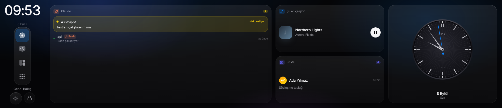
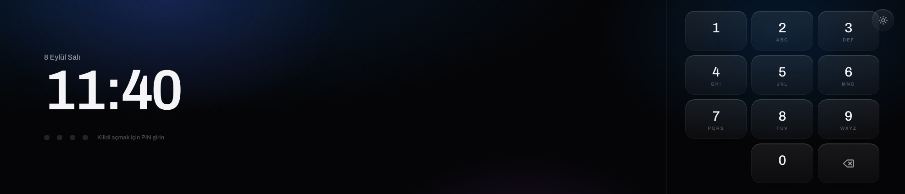
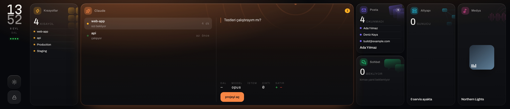
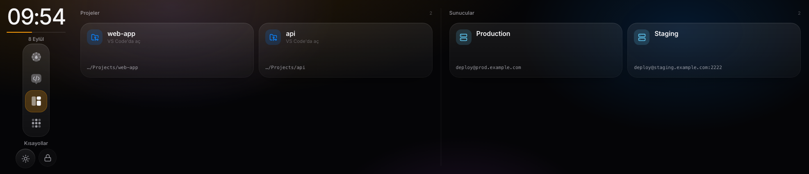
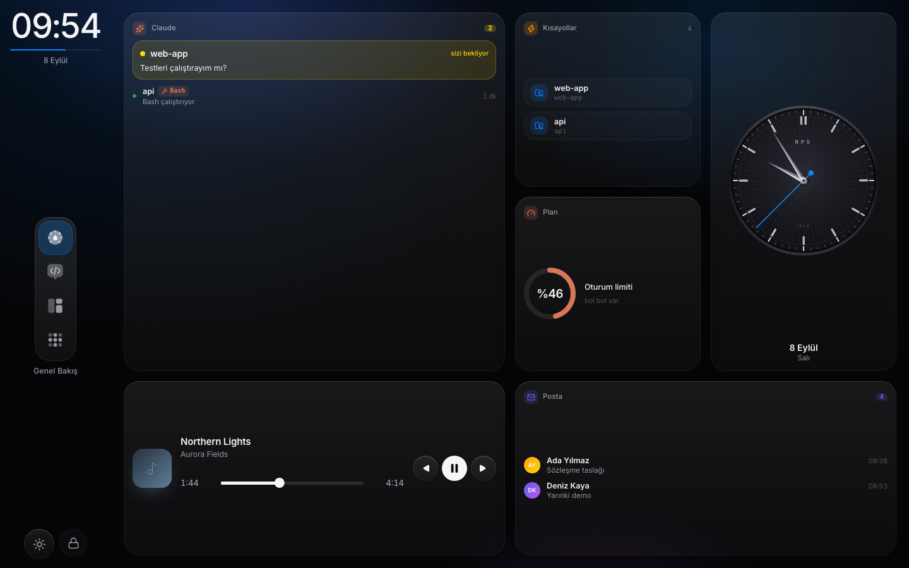
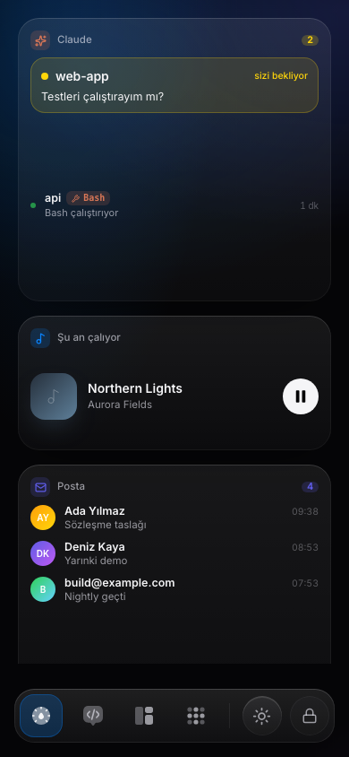
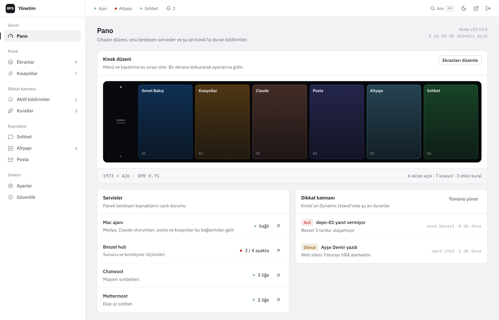
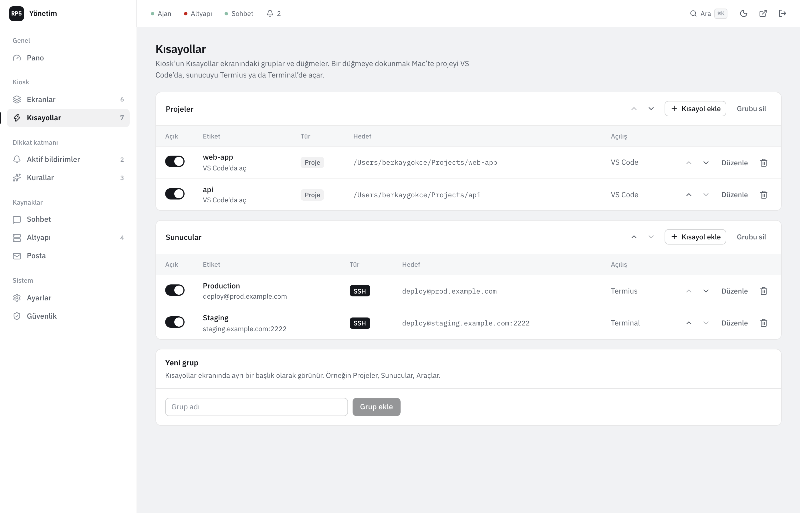

# RP5 Panel

A small operating system for the screen on your desk. A core runs the show, devices dial into it, and the display is a deck of panels you can actually operate: now playing, Claude Code sessions waiting on you, unanswered chats, unread mail, servers that stopped answering — each one a touch away from its detail and its actions, without ever leaving the screen.

It was built for a Raspberry Pi 5 driving an ultra-wide 11.9″ strip, but nothing is tied to that screen. The same interface lays itself out on a desktop, a tablet or a phone, and the core can run on your Mac or on a server behind a domain.

Built with Next.js 16, React 19, Tailwind v4 and Prisma. Only real data, only real actions: nothing on the panel is a mock.



| Lock screen | Claude, opened | Shortcuts, opened |
| --- | --- | --- |
|  |  |  |

The same deck, laid out for two other surfaces:

| Desktop | Phone |
| --- | --- |
|  |  |

## What it does

- **A deck you operate, not a dashboard you read.** The screen is a grid of columns: an app holds a column, or two share one — mail and chat do by default. Each panel shows its own summary: a headline number, a live graphic, and the one line that matters. Touch one and it expands in place, growing sideways and, if it shares a column, downwards too; its neighbours narrow but keep their names, counts and lists. Inside an open panel there is a second level and real work: open a project on the Mac, drill from the fleet into a server and then into one container's full report, fire a shortcut, scrub a track. Touching dead space closes it, and so does a minute of stillness.
- **Shortcuts.** One tap opens a project in VS Code or an SSH session in Termius or Terminal on the Mac. Each key carries its target and when it last fired; the core counts every successful run, so the widget orders itself by what you actually use. The result appears on the key you pressed.
- **Claude.** Claude Code sessions on the Mac: running, waiting for you, or closed. Tokens per session, today's usage, and a live event feed for the selected session.
- **Mail.** Your Spark Desktop inbox, read directly from Spark's local database: accounts, unread counts, message list and preview.
- **Infra.** A fleet table where processor, memory and disk line up across every server, powered by [Beszel](https://beszel.dev). The left column names what is broken and jumps straight to it. Drill in for rings, services, metrics, `docker inspect` and logs that collapse repeated lines into one row with a count.
- **Chat.** Chatwoot (customer conversations) and Mattermost (team chat) in one screen: the conversations assigned to you, who is still waiting for your reply and for how long, plus mentions, direct and group messages. Tap an item for the recent messages. Read-only.
- **Attention layer.** A notice arrives in a dock beside the spine, carries its own actions, and withdraws after ten seconds; `urgent` ones stay until dismissed and survive restarts. A bell in the spine counts what is waiting and calls them all back. The lock screen shows the count. Anything can post a notice: the agent, built-in monitors, a CI webhook, an uptime service. A notice can carry actions, and tapping one routes the work back to the device that can do it.
- **One interface, many surfaces.** The grid is derived from the screen: 4×2 on the strip, 4×3 on a desktop, a single scrolling column on a phone, where the rail lies down and becomes a bottom bar.
- **Admin panel.** `/admin` from your computer: screens, shortcuts, notice rules, active notices, infra, mail, settings and security. Everything lives in SQLite; the kiosk pulls its configuration from the API, so nothing is hard-coded.
- **Lock screen.** Server-validated PIN, rate limited, auto-lock after inactivity.



## How it fits together

```
                         ┌──────────────────────────────────┐
   Mac agent ───────────►│                                  │
   (provider, dials out) │   Core — Next.js            :3012│
                         │   /ws   one socket, two roles    │
   Pi kiosk   ──────────►│   /api  config · notices · admin │
   Phone      ──────────►│   SQLite (Prisma)                │
   Browser    ──────────►│                                  │
   (surfaces)            └───────────────┬──────────────────┘
                                         │ REST
                          Beszel hub ◄── agents on your servers
```

The Next.js app is the core, and everything else dials into it. There are two roles on the single `/ws` socket. A **provider** announces what it can do; the Mac agent connects outward with a device token, so nothing needs to be reachable on the machine it runs on and the core can sit on a remote host. A **surface** is a screen: the Pi, a phone, a browser tab. Surfaces subscribe to state domains and send intents; the core finds a provider for the capability, forwards the work and carries the acknowledgement back.

The core keeps the last value of every domain, so a surface that connects late opens already full, and it publishes presence so a provider that drops out is visible rather than silently stale. Devices enrol from the console, where a token is issued once and stored only as a hash.

## Requirements

- macOS for the agent (AppleScript for Spotify and Music, `media-control` for browser media, Spark Desktop's local database, `~/.claude` for Claude Code sessions)
- Node.js 20 or newer
- Optional: Docker for the Beszel hub, [Termius](https://termius.com), the VS Code `code` CLI, `brew install media-control`
- A Raspberry Pi with a 1973×426 display for the kiosk, or any browser window at that size

## Quick start

```bash
git clone https://github.com/berkaygkc/rp5-panel.git
cd rp5-panel
npm install                       # also generates the Prisma client
cp .env.local.example .env.local  # set NOTICE_TOKEN and ADMIN_SESSION_SECRET
npm run db:push                   # create .data/panel.db
npm run db:seed                   # starter screens, example shortcuts and rules
npm run dev                       # http://localhost:3012
```

In a second terminal, start the Mac agent. Use your own terminal rather than one opened inside a Claude Code session: Claude marks child processes, and the agent takes care to launch things with a clean environment.

```bash
cd clients/mac-agent
npm install
cp .env.example .env              # PANEL_URL and PANEL_NOTICE_TOKEN
npm run dev
```

The default PIN is `1234`. The first visit to `http://localhost:3012/admin` asks you to create the admin password; change the PIN under Security.

On first run macOS asks the agent's terminal for automation permission for Spotify and Music.

### Pi kiosk

Point Chromium in kiosk mode at the core's address, for example `http://<your-mac>.local:3012` on a LAN or your own domain once the core is hosted. The kiosk opens one socket back to whatever host served the page, so there is nothing else to configure on the device.

The Next.js dev server only serves LAN origins it knows about. Set `PANEL_LAN_SUBNET` if your network is not `192.168.1.x`.

## Admin panel

`/admin` is meant to be opened from a computer, not from the kiosk. It is a single-admin panel: the password is hashed with scrypt, the session is a signed httpOnly cookie, and every API route checks it.

| Page | What you manage |
| --- | --- |
| Dashboard | Agent, Beszel and server health, counts |
| Panels | Order and visibility of the deck's panels; title and colour, the latter used by the classic shell |
| Shortcuts | Groups and buttons: project (VS Code) or SSH (Termius or Terminal), ordering, enable/disable |
| Rules | Notice rules that set severity, kind and target screen; ordering; a live tester |
| Active notices | What the device is showing right now; send a test notice; dismiss |
| Widgets | The classic shell's dashboard: enable, importance, allowed sizes, pinning, and a layout simulator |
| Chat | Chatwoot and Mattermost credentials with connection tests, polling and notice behaviour, a live preview, and step-by-step docs for obtaining access tokens |
| Infra | Beszel connection with a connection test, server display names, order and visibility, disk threshold, poll interval |
| Mail | Excluded account patterns, notice and list limits |
| Settings | Default theme, lock timeout, Claude waiting threshold, weather location |
| Devices | Providers and surfaces on the core, enrolment tokens, revocation |
| Security | Kiosk PIN and admin password |

The console is keyboard-first: `⌘K` opens a command palette for navigation and quick actions, `⌘S` saves whatever page you are editing, and `Esc` closes drawers. A status strip across the top carries the live state of the agent, the Beszel hub and the chat sources on every page, and the dashboard opens with a to-scale diagram of the deck — the real aspect ratio, the real columns, the pair that shares one, updating as you reorder. Colour is reserved for state and for each app's own hue; the chrome is achromatic.

The kiosk refreshes its configuration every minute and whenever it regains focus. Secrets (the PIN, the Beszel password, the admin password hash) never leave the server; the PIN is validated only by `POST /api/unlock`.



## Widgets and the classic shell

The previous interface — a side rail, one screen per app, and a dashboard that composed itself out of widgets — still ships, at `/classic`. Its composition engine is what the admin console's widget simulator drives, and it is the fallback if the deck ever needs to be rolled back.

Widgets are the unit of that dashboard. A widget declares which sizes it supports in grid cells, a default importance, and a function that looks at live data and returns how urgent it is right now.

A widget leads with the answer, not a count. The small slot names the conversation that has waited longest or the server that stopped answering; the count goes in the header. Bigger slots show more of the same list rather than a different idea, so a widget reads as a window into its app.

| Size | Cells | Typical use |
| --- | --- | --- |
| 1×1 | 1 | the single most important thing, named |
| 2×1 | 2 | a row of items |
| 1×2 | 2 | a vertical stack |
| 2×2 | 4 | the hero, with controls |

The score is `0.4 × importance + 0.6 × urgency`. Above 68 a widget may take four cells, above 42 it may take two, below that it gets one. Zero urgency means it does not appear. Pinning a widget to a slot keeps it there, which is how the clock holds its corner.

The engine is a pure function with a test suite (`npx tsx scripts/compose.test.ts`), which is what makes the admin console able to simulate a situation — a server down, Claude waiting, nothing at all — and show the exact layout the device would produce.

Adding an app means writing widget components, adding an entry to `lib/os/catalog.ts` with its urgency rule, and wiring the component in `lib/os/registry.tsx`. The shell does not change.

## Notices API

Any system can push a notice to the panel. The `id` is stable: posting the same id again updates the notice instead of showing it twice, and deleting it clears it.

| Endpoint | Auth | Purpose |
| --- | --- | --- |
| `POST /api/notices` | `Authorization: Bearer <NOTICE_TOKEN>` | Create or update |
| `DELETE /api/notices/{id}` | Bearer token | Clear (producer) or dismiss (user) |
| `GET /api/notices` | none | Active notices |
| `GET /api/notices/stream` | none | Server-sent events: `snapshot`, `notice`, `clear` |

```bash
curl -X POST http://localhost:3012/api/notices \
  -H "authorization: Bearer $NOTICE_TOKEN" -H "content-type: application/json" \
  -d '{"id":"ci:web:main","kind":"ci","severity":"urgent",
       "title":"Build failed on main","body":"web · run #418","screen":"shortcuts"}'
```

Fields: `id`, `title`, optional `body`, `kind` (`claude`, `mail`, `ci`, `server`, `system`, or anything), `severity` (`info`, `attention`, `urgent`), `screen` to open on tap, `ttlMs`, and free-form `meta` used by rules. Urgent notices are persisted to disk and ignore `ttlMs`.

Built-in producers: the Mac agent (Claude sessions waiting for input, new mail, shortcut failures), the panel's Beszel monitor (server down, container unhealthy, disk above threshold) and the chat monitor (unread customer message in a conversation assigned to you, Mattermost mentions and direct messages). A notice you dismiss on the kiosk does not fire again unless its content changes.

## Server monitoring

The panel reads from a Beszel hub. `infra/docker-compose.yml` runs the hub next to the panel, with Uptime Kuma as an optional profile:

```bash
cd infra
docker compose up -d                  # Beszel hub on http://localhost:8090
docker compose --profile kuma up -d   # plus Uptime Kuma on http://localhost:3021
```

Create a Beszel user for the panel, assign your systems to it, and enter the credentials under Admin → Infra. Beszel agents connect outward to the hub, so servers do not need open ports. Container logs and `docker inspect` come from the hub's container endpoints.

## Chat sources

The panel polls Chatwoot and Mattermost from the server, never from the kiosk, and only reads.

- **Chatwoot** uses a user access token (Profile Settings → Access Token) against the Application API, and reads only the open conversations assigned to you (`assignee_type=me`): their unread counts and waiting times, unread mention notifications, inbox names, and the messages of a selected conversation. The unassigned queue is never queried. The account id is taken from the token's first account unless you set it.
- **Mattermost** uses a personal access token, or a username and password that the panel exchanges for a session token via `/api/v4/users/login` and renews when it expires. It reads your teams, channel memberships with unread and mention counters, direct and group channels, the last post of listed channels, and the last 40 posts of a selected channel.

Enter both under Admin → Chat, which includes a connection test and the exact clicks needed to obtain each token.

## Deploying the core

The core is a Next.js app with a custom server, so HTTP and the `/ws` socket share one port. It runs anywhere Node runs.

```bash
cp .env.local.example .env      # NOTICE_TOKEN and ADMIN_SESSION_SECRET at minimum
docker compose up -d --build
docker compose exec core npx prisma db push
docker compose exec core node prisma/seed.cjs
```

Put it behind a reverse proxy with TLS and make sure the proxy forwards WebSocket upgrades on `/ws`. Then open the console, add a device for your Mac, and paste the token into the agent's `.env` next to `PANEL_URL`. The agent dials out, so it works from a laptop on any network.

To keep the agent running, copy `clients/mac-agent/deploy/com.rp5.agent.plist` into `~/Library/LaunchAgents`, fix the paths inside and `launchctl load` it.

## Configuration

| Variable | Where | Meaning |
| --- | --- | --- |
| `NOTICE_TOKEN` | panel `.env.local` | Shared secret for notice producers; required, the API fails closed without it |
| `ADMIN_SESSION_SECRET` | panel `.env.local` | Signs the admin session cookie |
| `BESZEL_URL`, `BESZEL_EMAIL`, `BESZEL_PASSWORD` | panel `.env.local` | Seed values for the Beszel connection; edit later in the admin panel |
| `PANEL_DATA_DIR` | panel | Directory for `panel.db` and `notices.json`, default `./.data` |
| `PANEL_LAN_SUBNET` | panel | Subnet allowed to load the dev server, default `192.168.1` |
| `PORT` | core | Port for HTTP and the `/ws` socket, default 3012 |
| `PANEL_URL` | agent `.env` | The core to dial; the agent derives `ws(s)://…/ws` from it |
| `DEVICE_TOKEN`, `DEVICE_NAME` | agent `.env` | Enrolment token issued by the console, and how the device names itself |
| `PANEL_NOTICE_TOKEN` | agent `.env` | Shared secret for posting notices over HTTP |

Everything else (PIN, lock timeout, theme, rail slots, thresholds, mail exclusions) lives in the database and is edited in the admin panel.

## Project layout

```
app/(kiosk)            Kiosk root layout and page (fixed 1973×426 body)
app/(admin)/admin      Admin panel: setup, login, and the management pages
app/api                config, unlock, notices, agent config, admin API
components/shell       Pager, side rail, app menu, lock screen, notice island
components/screens     Overview, Shortcuts, Claude, Mail, Infra, Chat
components/admin       Admin shell and UI primitives
lib/server             Prisma client, settings cache, notice store and rules, Beszel and chat monitors, admin auth
lib/server/chat        Chatwoot and Mattermost API clients
lib/data               Kiosk data hooks (media, Claude, mail, infra, shortcuts)
lib/motion             Hand-rolled spring physics and gesture helpers
clients/mac-agent      The Mac agent (WebSocket server, AppleScript, MediaRemote, Spark, Claude Code)
prisma                 Schema and seed
infra                  Beszel and Uptime Kuma compose file
docs                   Screenshots and the original design brief (Turkish)
```

## Design notes

The panel targets one device and one distance: a strip display within arm's reach. The rules that follow from that:

- The strip display, 1973×426, is the reference canvas, but no layout is pinned to it: below 900px the deck turns from a row of panels into a vertical accordion and the spine lies down into a top bar, so a phone gets the same system in its own shape.
- Motion is `transform`, `opacity` and the deck's two grid tracks; no backdrop blur. The Pi's GPU has to hold 60 fps. Expanding content waits for the box to settle before it fades in, so nothing is seen reflowing.
- Design tokens live on the element the page actually renders. A token declared on a class that is not on stage makes every `var()` shorthand invalid, and transitions die silently — this cost a day to find once.
- Gestures track the finger 1:1 and can be interrupted at any moment. Feedback happens on pointer-down, not on release. A drag is never a tap: more than ten pixels of travel and the tap is ignored.
- Drill-downs follow one standard: overview → list → detail, inside the panel, with the same back chevron and the same empty and failure states everywhere.
- The device has two gears. It works while it is being touched or while something is wrong, and after ninety seconds of quiet it dims, releases whatever panel was open, and waits.
- Dark and light themes share one token set; the kiosk remembers the user's choice, the admin panel sets the default.
- The admin panel is a quiet desktop surface: save buttons enable when something changed, deletion is a two-step confirm, and every action reports back in the same words it was named with.

The UI copy is Turkish. Strings live next to the components; an i18n layer is a welcome contribution.

## Development

```bash
npm run lint            # ESLint with the React Compiler rules
npx tsc --noEmit        # panel
cd clients/mac-agent && npm run typecheck
npm run db:studio       # browse the database
```

The project uses a Next.js version whose conventions may differ from what you remember; `node_modules/next/dist/docs/` is the reference the repo's `AGENTS.md` points at.

## License

MIT. See [LICENSE](LICENSE).
